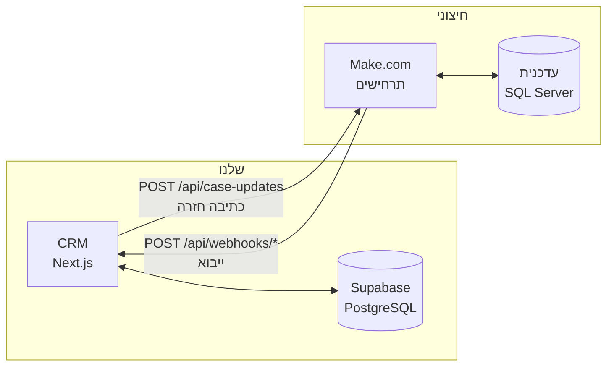

# Gamburg CRM - מדריך כניסה למפתח חדש

המסמך הזה נועד לאדם שרואה את הקוד הזה בפעם הראשונה. הוא עונה על ארבע
שאלות: מה המערכת הזאת עושה, איך מריצים אותה, למה מתחברים ואיך, ואיפה
מחפשים כשמשהו לא עובד.

מסמכים אחרים ב-repo נכנסים לעומק בנושאים ספציפיים, והמדריך הזה מפנה
אליהם במקום לשכפל אותם. **קרא קודם את המסמך הזה, ואחר כך את
[`AGENTS.md`](./AGENTS.md)** - שם מרוכזות תקלות שכבר עלו לנו ימי עבודה,
וכולן כאלה שקשה מאוד לגלות לבד.

---

## 1. מה המערכת הזאת, ומי נגד מי

זו לא מערכת אחת אלא **שלוש**, ורוב הבלבול של מפתח חדש נובע מלא להבין
את החלוקה ביניהן:

| המערכת | מה היא | מי הבעלים |
|---|---|---|
| **CRM** (ה-repo הזה) | אפליקציית Next.js. המסכים שהמשרד עובד איתם ביום-יום. | אנחנו |
| **Supabase** | PostgreSQL + אימות משתמשים + Realtime. בסיס הנתונים של ה-CRM. | אנחנו |
| **עדכנית** | מערכת ניהול משרדי עורכי דין מסחרית, על SQL Server. **מערכת חיצונית שאין לנו שליטה עליה.** | ספק חיצוני |
| **Make.com** | שכבת האינטגרציה. כל תנועת נתונים בין ה-CRM לעדכנית עוברת דרך תרחישים ב-Make. | אנחנו מגדירים, לא בקוד |



**הנקודה הקריטית:** ה-CRM **לא מתחבר לעדכנית ישירות**. אין connection string
ל-SQL Server בשום מקום בקוד. כל תנועה עוברת דרך Make, ולכן חלק ניכר
מהתקלות שתיתקל בהן אינן באגים בקוד אלא תרחיש ב-Make שלא מוגדר נכון.

עדכנית היא **מקור האמת** לנתוני התיקים: מספר תיק, שם, סטטוס, סוג, מטפל,
צוות ופרטי לקוח מגיעים משם ונדרסים בכל סנכרון. שדות שקיימים רק ב-CRM
(דגלים, הערת מנהל, מעקב, שלב בתיק) אף פעם לא נדרסים.

---

## 2. הרצה מקומית

```bash
npm install
cp .env.example .env.local     # ראה סעיף 3
npm run dev
```

הסביבה: **Next.js 16.2.10, React 19.2.4, TypeScript**.

שתי אזהרות שיחסכו לך זמן:

**Next.js 16 שינה דברים.** ה-Middleware נקרא עכשיו Proxy - רענון ה-session
והפניית האימות יושבים ב-`proxy.ts` בשורש וב-`lib/supabase/proxy.ts`, ואין
קובץ `middleware.ts`. אם משהו בהתנהגות של Next נראה לך מוזר, קרא את
המדריך הרלוונטי תחת `node_modules/next/dist/docs/` לפני שאתה מניח שאתה
יודע איך זה עובד. זה כתוב גם ב-`AGENTS.md` והוא מתכוון לזה.

**בדיקת ממשק אמיתית דורשת build.** במצב `next dev` יש סביבות שבהן
ה-hydration לא עובד ודפים נשארים בלי React פעיל - מה שנראה כמו באג
בקוד. לאימות של התנהגות אינטראקטיבית:

```bash
npm run build && npx next start
```

---

## 3. משתני סביבה

הרשימה המלאה עם הסברים נמצאת ב-[`.env.example`](./.env.example). בקצרה:

| משתנה | מה זה | מאיפה |
|---|---|---|
| `NEXT_PUBLIC_SUPABASE_URL` | כתובת פרויקט ה-Supabase | דשבורד Supabase → Project Settings → API |
| `NEXT_PUBLIC_SUPABASE_ANON_KEY` | מפתח ציבורי. נשלח לכל דפדפן, לא סוד. | אותו מקום |
| `SUPABASE_SERVICE_ROLE_KEY` | **סוד.** עוקף RLS לגמרי. | אותו מקום |
| `MAKE_OUTGOING_WEBHOOK_URL` | כתובת התרחיש ב-Make שמקבל כתיבה חזרה מה-CRM | Make, מודול Webhook |
| `MAKE_INCOMING_WEBHOOK_SECRET` | סוד משותף לדחיפת מסמך חדש | אתה בוחר, ומגדיר את אותו ערך ב-Make |
| `MAKE_CASE_SYNC_WEBHOOK_SECRET` | סוד לייבוא תיקים | כנ״ל |
| `MAKE_TASK_SYNC_WEBHOOK_SECRET` | סוד לייבוא משימות (משמש גם ל-task-reconcile ו-task-deletions) | כנ״ל |
| `MAKE_DEADLINE_SYNC_WEBHOOK_SECRET` | סוד לייבוא מועדים | כנ״ל |
| `MAKE_CASE_FIELD_SYNC_WEBHOOK_SECRET` | סוד לייבוא חוצצים | כנ״ל |

`NEXT_PUBLIC_*` נצרבים לתוך ה-build. **שינוי שלהם דורש `npm run build`
מחדש, לא רק restart** - זו טעות שקל מאוד ליפול בה.

### הסודות ניתנים לעקיפה מתוך המסך

טבלת `webhook_configs` מאפשרת למנהל לערוך סוד או כתובת מתוך
`/dashboard/webhooks`, בלי SSH ובלי build. כל route בודק קודם את הטבלה
ורק אם היא ריקה נופל למשתנה הסביבה (`lib/webhook-config.ts`).

**המשמעות למפתח:** אם סוד לא עובד, אל תניח שהערך ב-`.env.production` הוא
מה שרץ בפועל. תבדוק גם בטבלה.

---

## 4. אל מה מתחברים ואיך

### Supabase

הפרויקט: `kexclvsdxplzahcxsmgw` (הכתובת המלאה ב-`.env.production` על השרת).
הגישה דרך הדשבורד ב-supabase.com עם חשבון בעל הרשאה לפרויקט.

מה תעשה שם בפועל: להריץ מיגרציות ב-SQL editor, לבדוק נתונים, ולנהל
משתמשים ב-Authentication.

### השרת (production)

מתארח ב-Cloudways. **התיקייה בפועל: `/home/master/gamburg`** - שים לב
ש-[`DEPLOY.md`](./DEPLOY.md) מתאר מבנה `~/applications/<app>/public_html`,
וזה לא הנתיב בשרת הנוכחי.

```bash
ssh <user>@<host>
cd /home/master/gamburg
pm2 status              # מצב התהליכים
pm2 logs gamburg-crm    # לוגים חיים
./scripts/deploy.sh     # git pull + npm ci + build + pm2 reload
```

התשתית: Node דרך nvm, PM2 במצב cluster, Nginx כ-reverse proxy לפורט 3000,
ומנהרת Cloudflare. הכל מפורט ב-[`DEPLOY.md`](./DEPLOY.md).

### Make.com

התרחישים לא נמצאים ב-repo - הם מוגדרים בממשק של Make. מה שכן מתועד:
- [`docs/make-write-back.md`](./docs/make-write-back.md) - החוזה המלא של
  הכתיבה חזרה, טבלת הניתוב, ומדריך בנייה.
- [`docs/case-field-pull.md`](./docs/case-field-pull.md) - ייבוא החוצצים.
- [`docs/task-deletions.md`](./docs/task-deletions.md) - מחיקת משימות.

### עדכנית (SQL Server)

הגישה דרך Make בלבד. ה-views שאנחנו קוראים מהם:

| View | מה יש בו |
|---|---|
| `vwExportToOuterSystems_Files` | התיקים. **אין בו עמודת מטפל** - צריך JOIN. |
| `vwExportToOuterSystems_LoginUsers` | משתמשים: `UserID`, `FullName`, `Active`, `EMail` |
| `vwExportToOuterSystems_UserData` | שדות החוצצים |
| `vwMainTik` | התיק המלא, כולל `TikMetaplim` (רשימת מטפלים) |

`VisualID` ב-`vwMainTik` ו-`TikNumber` ב-view הייצוא מכילים את מספר התיק
בפורמט `100/0` - זהה ל-`case_number` אצלנו. `ID` הוא אותו ערך עם אפסים
מובילים ולא מתאים להשוואה.

**אזהרה:** ה-views האלה נועדו לקריאה. כתיבה דרכם נכשלת בשקט - ראה
`AGENTS.md`.

---

## 5. מודל הנתונים

20 טבלאות. המרכזיות:

| טבלה | תפקיד |
|---|---|
| `cases` | התיק. מזוהה ב-`case_number` (ייחודי, מגיע מעדכנית). |
| `case_fields` | שדות החוצצים - `page_name` + `field_name` + ערך. הטבלה הכבדה במערכת. |
| `case_deadlines` | מועדים |
| `tasks` | משימות. `source_task_id` מסמן משימה שהגיעה מעדכנית. |
| `profiles` | משתמשים. `id` הוא FK קשיח ל-`auth.users`. |
| `notifications` | פעמון ההתראות, דרך Supabase Realtime |
| `view_templates` | תבניות סינון שמורות, וגם סידור התרשימים בדשבורד |
| `webhook_configs` / `webhook_logs` | פאנל הוובהוקים ויומן הקריאות |

שתי נקודות שחוסכות שעות:

**`profiles.id` הוא FK ל-`auth.users`.** אי אפשר ליצור פרופיל בלי משתמש
אימות אמיתי. לכן מטפל שנוצר אוטומטית מסנכרון מקבל אימייל מציאותי-אך-בלתי-שמיש
תחת `.invalid` וסיסמה אקראית - ראה `lib/handler-resolution.ts` ומיגרציה 0047.

**`last_touched_at` הוא לא "עודכן לאחרונה".** הוא מתעדכן רק בשינוי סטטוס,
דגל, הערה או מעקב - לא בסנכרון רגיל. זה מה שמאפשר את זיהוי "התיקים
התקועים" (30 יום בלי נגיעה, מיגרציה 0005).

הסכמה המלאה, מדיניות ה-RLS, וכיצד מריצים את מערך בדיקות ה-RLS:
[`supabase/README.md`](./supabase/README.md) ו-`scripts/test-rls.sh`.

---

## 6. זרימות הסנכרון

### פנימה: עדכנית → CRM

כולם מאומתים ב-header `x-webhook-secret`, לא ב-session של משתמש.

| Endpoint | מה נכנס |
|---|---|
| `POST /api/webhooks/case-sync` | תיקים |
| `POST /api/webhooks/task-sync` | משימות |
| `POST /api/webhooks/deadline-sync` | מועדים |
| `POST /api/webhooks/case-field-sync` | חוצצים, באצוות |
| `POST /api/webhooks/task-reconcile` | רשימת המשימות הפתוחות - סוגר מה שנעלם |
| `POST /api/webhooks/task-deletions` | רשימת כל המשימות - מוחק מה שאינו בה |
| `POST /api/webhooks/incoming-document` | מסמך חדש הגיע |

### החוצה: CRM → עדכנית

| Endpoint | מתי |
|---|---|
| `POST /api/case-updates` | כל עריכת שדה, מכל מסך |
| `POST /api/task-create` | יצירת משימה |
| `POST /api/task-delete` | מחיקת משימה - מוחק שם קודם, ורק אם הצליח מוחק כאן |

הכתיבות בצד הלקוח **אופטימיות**: ה-CRM שומר מיד ומגלגל אחורה אם Make
מחזיר `failure`. זו הסיבה שתקלה בתרחיש ב-Make נראית כמו עריכה שקופצת
חזרה אחרי חצי שנייה. **ראה את הסעיף על Make ב-`AGENTS.md` לפני שאתה מחפש
את זה בקוד.**

---

## 7. פריסה ומיגרציות

```bash
cd /home/master/gamburg && ./scripts/deploy.sh
```

**`deploy.sh` לא מריץ מיגרציות.** הוא עושה `git pull`, `npm ci`,
`npm run build` ו-`pm2 reload` - שום דבר לא נוגע ב-Supabase. כל קובץ חדש
תחת `supabase/migrations/` דורש הרצה ידנית ב-SQL editor, לפי הסדר.

זו התקלה הכי חוזרת בפרויקט הזה. התסמין: הקוד החדש רץ אבל נכשל על עמודה
שלא קיימת, וזה נראה כאילו הקוד שגוי בזמן שהסכמה היא זו שמאחור.

**עצה:** אחרי יצירת אינדקס, הרץ `analyze` על הטבלה. בלי זה המתכנן עלול
לעבוד עם סטטיסטיקות ישנות ולהתעלם מהאינדקס לגמרי.

---

## 8. איפה מחפשים

```
app/
  (מסכים)         cases/ tasks/ deadlines/ approvals/ dashboard/ login/
  api/            נקודות הקצה - ראה סעיף 6
lib/
  supabase/       client (דפדפן) / server (SSR) / admin (service role) / proxy
  webhook-handler.ts    עטיפה משותפת לכל ה-webhooks הנכנסים: אימות, לוג, תשובה
  handler-resolution.ts פענוח שם מטפל לפרופיל, כולל יצירה אוטומטית
  case-filter-fields.ts הגדרת השדות שאפשר לסנן לפיהם, משותפת לכל המסכים
components/       רכיבי UI משותפים
types/database.ts הטיפוסים של כל הטבלאות
supabase/migrations/  לפי סדר מספרי. אף פעם לא לערוך מיגרציה שכבר רצה.
```

**שני כללים לא-מובנים-מאליהם בקוד הזה:**

`lib/supabase/admin.ts` עוקף RLS. הוא נקרא רק מקוד שרת שכבר אימת את
הקורא. **אף פעם לא לייבא אותו לקומפוננטת לקוח.**

כל `<Link>` חייב `prefetch={false}` אלא אם היעד באמת זול. ההסבר המלא
והמדידות ב-`AGENTS.md`.

---

## 9. כשמשהו לא עובד

**סנכרון לא מגיע או מגיע שגוי** → `/dashboard/webhooks`. יומן הקריאות שם
שומר גוף בקשה ותשובה לכל קריאה, כולל אזהרות. זה המקום הראשון להסתכל בו,
לפני הקוד ולפני Make.

**עריכה נשמרת ואז קופצת חזרה** → התרחיש ב-Make חסר מודול Webhook response,
או שהוא לא מחזיר JSON תקין. `AGENTS.md`, סעיף Make.

**האפליקציה נופלת או לא עולה** → `pm2 status` ו-`pm2 logs gamburg-crm`.
502 מ-Nginx פירושו שהתהליך לא רץ או שהפורט שגוי.

**שאילתה מחזירה ריק אבל הנתון קיים** → אל תניח שזו בעיית הרשאות. קרא את
הסעיף על גבול ה-client/server ב-`AGENTS.md`. הבאג הזה עלה לנו יום שלם,
והוא לא מייצר שום שגיאה בשום שכבה.

**שדה אופציונלי לא מגיע** → בדוק ש-view הייצוא בעדכנית בכלל מכיל את
העמודה, ושהתרחיש ב-Make ממפה אותה לגוף הבקשה. שדה חסר נראה בדיוק כמו
שדה ריק, ולא מייצר שגיאה. גם זה ב-`AGENTS.md`.

---

## 10. מפת המסמכים

| מסמך | מתי לקרוא |
|---|---|
| [`AGENTS.md`](./AGENTS.md) | **לפני שנוגעים בקוד.** תקלות שכבר עלו לנו ימים. |
| [`README.md`](./README.md) | סקירה קצרה של המסכים והוובהוקים |
| [`DEPLOY.md`](./DEPLOY.md) | הקמת שרת מאפס: Node, PM2, Nginx, SSL, Cloudflare |
| [`supabase/README.md`](./supabase/README.md) | סכמה, RLS, הרצת בדיקות ההרשאות |
| [`docs/make-write-back.md`](./docs/make-write-back.md) | בניית תרחיש כתיבה חזרה ב-Make |
| [`docs/case-field-pull.md`](./docs/case-field-pull.md) | ייבוא החוצצים |
| [`docs/task-deletions.md`](./docs/task-deletions.md) | מחיקת משימות משני הצדדים |
